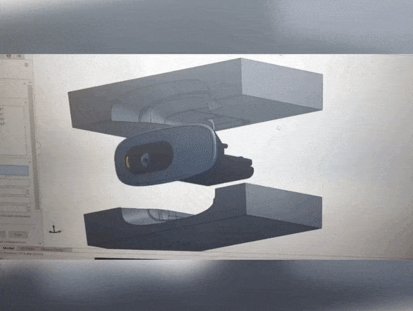

# Affordable Stereo Camera

## Project in brief

<a href="https://en.wikipedia.org/wiki/Stereo_camera" target="_blank">Stereo cameras</a> are a standard solutions for depth perception. However, these cameras are quite expensive compared to regular USB cameras. This project aims to create a custom RGB-D camera for under 80 Dollars that can be used to scan and reconstruct 3D objects. The project is divided into two major parts:

1. Design and Fabrication of the stereo camera setup.
2. Developing software to capture accurate RGB-D frames with the setup.

  

  Stereo image pairs with corresponding disparity maps in the middle captured using the low-cost stereo camera for 3D reconstruction.

## Design and Fabrication
---

A 3D printed casing was used to keep the cameras rigidly fixed with respect to each other. The casing was designed by [**Mandar Kadwekar**](https://www.linkedin.com/in/mandar-kadwekar-19706a170/). The casing is designed such that the imaging planes of the left and right cameras are almost parallel and horizontally aligned. To know more about the design and fabrication steps please refer to my post - <a href="https://learnopencv.com/making-a-low-cost-stereo-camera-using-opencv/" target="_blank"> Making A Low-Cost Stereo Camera Using OpenCV</a>. 

  

  Stages of StereoCam setup.

## StereoCam Library
---

Fixing the cameras rigidly in a casing is not enough to make a stereo camera work. We need to process the stereo image frames captured by the cameras to obtain accurate depth information. I wrote a library called **StereoCam** for this. It contains various functionalities to use, such stereo camera setup for extracting RGB-D frames. Some of the key steps involved in extracting depth information using the StereoCam library are explained below. 

### Stereo Calibration And Rectification

I created a **custom stereo calibration grid using ArUco markers**. This pattern is easier to detect compared to the checkerboard pattern. The marker detection is done using the <a href="https://docs.opencv.org/3.4/d5/dae/tutorial_aruco_detection.html" target="_blank">ArUco class</a> available in OpenCV library. **StereoCam** contains a utility method for capturing and detecting the calibration pattern with just a few lines of code.

  

  Capturing images of the calibration grid for stereo calibration.

### Generating Disparity Map Using Block Matching Algorithm

The **StereoCam** library has a facility to use the Block Matching algorithm for calculating dense stereo correspondence and the disparity map. The disparity map is then used for the calculation of depth maps. To learn more about disparity map and block matching algorithm please refer to my post <a href="https://learnopencv.com/depth-perception-using-stereo-camera-python-c/" target="_blank">Depth perception using stereo camera</a>. The post also explains how to convert disparity map to depth map. The Block Matching algorithm has several parameters that need to be tuned. **StereoCam** provides an interactive GUI to tune these parameters.

  

   GIF showing the process of fine-tuning the parameters Using StereoCam GUI.

### From disparity map to depth map

Disparity and depth are inversely related. An easy way to find an accurate mapping between them is by collecting pairs of depth and disparity values and find the best fitting curve using least-squares fitting.

  

  Capturing depth and disparity data points for curve fitting.

### Depth Estimation and 2.5 D Projection

Each pixel's depth is estimated using the depth map and the calibrated camera parameters, and a 3D point cloud is generated. This is usually called a 2.5 D projection. **StereoSGBM** method is used to estimate the disparity map, and the **WLS filter** is used to refine the disparity map. The depth map information and intrinsic camera parameters are used to get the 2.5 D representation using **back-projection equation**.

The point cloud generated in the above process is displayed using Open3D.

  

  Live pointcloud displayed using Open3D

## Applications Developed Using The Low-Cost Stereo Camera
---

### Capturing RGB-D Data For 3D Reconstruction

A single RGB-D image can be used to generate a 2.5 D pointcloud using back-projection. If we capture RGB-D images of an object from multiple view points, we can reconstruct a 3D model of the object by aligning all the individual 2.5 D pointclouds using methods like ICP - Iterative Closest Point algorithm. 

  

  Process of capturing stereo images for 3D reconstruction.

### Generating Anaglyph 3D Movies

We use stereopsis to perceive depth using our binocular vision system. We can simulate such disparities by artificially presenting two different images separately to each eye using a method called stereoscopy. Initially, for 3D movies, people achieved this by encoding each eye’s image using filters of red and cyan colors. They used the red-cyan 3D glasses to ensure that each of the two images reached the intended eye. This created the illusion of depth. The stereoscopic effect generated with this method is called anaglyph 3D.

  

  Anaglyph 3D movie created using stereo camera setup

## Future Work
---

I am working on deep learning-based method for improving the depth estimation results of my stereo camera. It would be interesting to see if a well-designed neural network and a pair of USB cameras can provide high fidelity depth maps comparable to the expensive commercially available RGB-D cameras.

## References
---

I learned the fundamental concepts of stereo vision from <a href="https://www.cse.iitb.ac.in/~sharat/current/cs763/" target="_blank">CS 763 - Computer Vision Course at IIT Bombay (sit through)</a>. This motivated me to develop a custom low-cost stereo camera. Some other references that were useful for me are as follows:

1. <a href="https://docs.opencv.org/master/dd/d53/tutorial_py_depthmap.html" target="_blank">Official OpenCV example - Depth Map from Stereo Images</a>.
2.  C. Loop and Z. Zhang. Computing Rectifying Homographies for Stereo Vision. IEEE Conf. Computer Vision and Pattern Recognition, 1999.
3. Hirschmüller, Heiko (2005). “Accurate and efficient stereo processing by semi-global matching and mutual information”. IEEE Conference on Computer Vision and Pattern Recognition. pp. 807–814.
4. Birchfield and C. Tomasi, “Depth discontinuities by pixel-to-pixelstereo,”International Journal of Computer Vision, vol. 35, no. 3,pp. 269–293, 1999.
5. Similar stereo camera project. <a href="https://github.com/LearnTechWithUs/Stereo-Vision" target="_blank">GitHub link</a>.

*Project page template inspired from [GradSLAM](https://gradslam.github.io/).*
